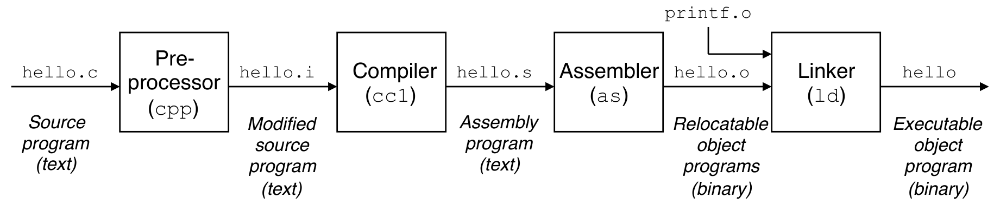
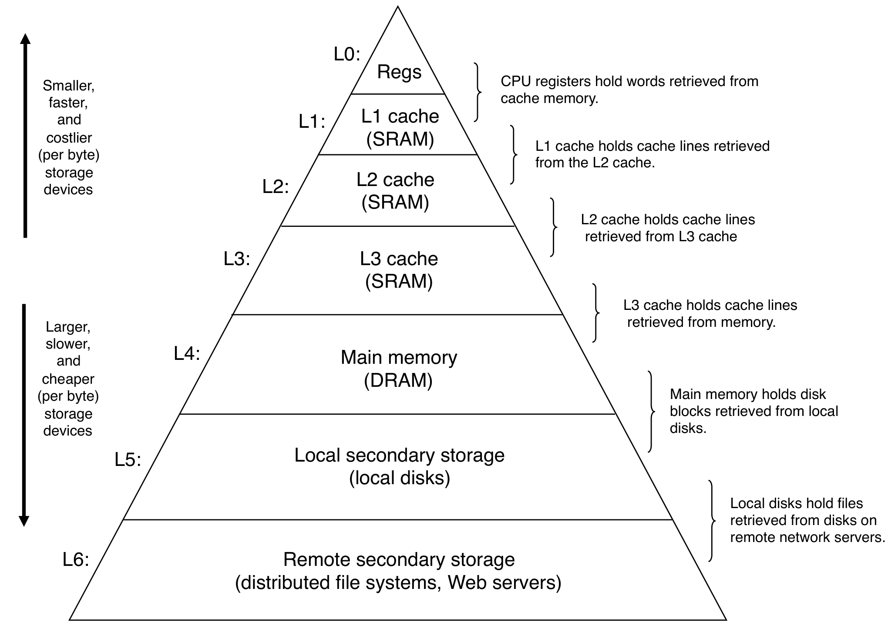
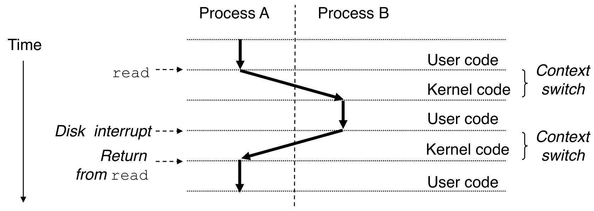
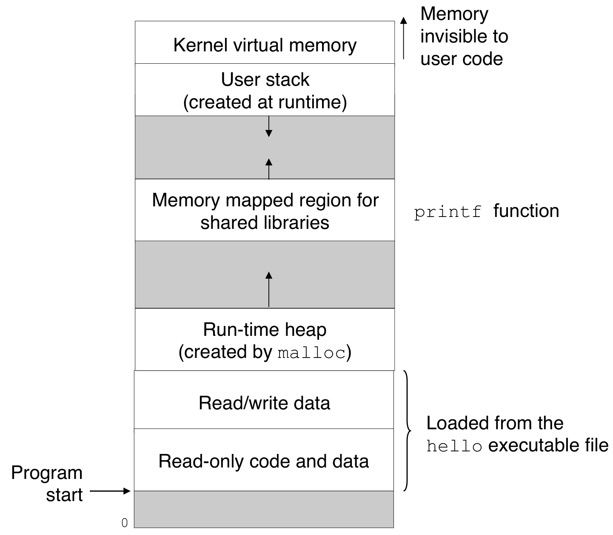

# Ch01 컴퓨터 시스템으로의여행(컴퓨터 구조 위주)

### 컴파일 시스템

프로그래머가 사용하는 고급언어(ex C)는 결국에 하드웨어가 이해할 수 있는 저급 기계어 명령어로 번역되어야한다.
그 번역을 당담하는 시스템이 컴파일 시스템이다.
컴파일 시스템은 전처리기->컴파일->어셈블리->링커 단계를 거쳐 컴퓨터가 실행할 수 있는 목적파일을만든다.

전처리: include한 헤더파일을 프로그램 문장에 직접 삽입한다.
컴파일: 전처리기가 만든 파일을 어셈블리어로 번역한다. (hello.s 참조)
어셈블리: 컴파일단계에서 만들어진 어셈블리파일을 기계어로 번역하고 이들을 재배치가능 목적프로그램의 형태로 묶어서 그 결과를 저장한다.
링커: C프로그램이 호출하는 프로그래머의 라이브러리도 위에 과정을 거쳐서 재배치 가능한 목적 프로그램의 형태로 만들어진다.
여기서 링커는 이 목적파일들을 하나로 묶는 역할을한다. (더 자세한 내용은 7장)

컴파일이 어떤 명령어를 만들어내는지 이해하는 것은 중요하다.
컴파일 결과는 프로그램의 성능과 밀접한 관련이 있다.

성능이 좋지 않은 컴파일러는 프로세서의 파이프라인 구조를 충분히 활용하지 못하고,
불필요한 지연(stall)을 유발하는 비효율적인 코드를 생성할 수 있다.

컴파일러는 명령어 재배치 등을 통해 이러한 지연을 줄이려 하지만,
해저드 자체는 하드웨어가 처리하며, 컴파일러의 역할은 성능 최적화에 가깝다.

### 프로세서 동작
보통 프로세서의 동작은 5단계로 나눈다.
명령어 인출(IF), 해독(ID), 실행(EX), 메모리 접근(MEM), 결과기록(WB)
명령어 인출을 위해서 pc가 가리키는 주소에 접근하고 명령어를 뽑고 pc는 다음 명령어주소를 참조한다.
명령어를 해독해서 연산에 맞는 제어신호를 전달한다.
필요한 자원들을 alu에 저장하고 연산한다.
alu연산결과가 주소가 될수도있으므로 이 주소를 이용하여 메모리에 접근하고 얻어낸 결과를 레지스터파일에 저장한다.

컴퓨터가 동작하기위해서는 많은 기능이 필요하지 않다
적재, 저장, 분기만 있으면 거의 모든 기능을 해낼 수 있다.

### 메모리 계층 구조

메모리 계층 구조는 컴퓨터 성능에 굉장히 중요하다.
위에 계층일수록 프로세서가 접근하는속도가 빠르다.
예를 들어서 프로세서가 필요한 데이터를 레지스터 파일에서 가져오는 속도와 디스크까지 내려가서 가져오는 속도는 천지차이다.
그러므로 가능한 밑으로 내려가지 않는 모델이 가장 성공적이라 할 수 있다.
이를 위해서 캐시, tlb, 지역성을 활용한 기술이 사용되고 있다.

메모리 계층 구조는 Amdahl의 법칙과도 굉장히 밀접하다.
아무리 레지스터 파일이 무한대로 빨라진다고해도 결국 전체 성능은 그리 올라가지 않는다.
하지만 캐시 적중률이 굉장히 높을 때 캐시도 같이 빨라진다면 무한대만큼은 아니지만 전체 성능은 보다 올라갈거라 생각한다.

### 프로세스
프로세스는 실행 중인 프로그램에 대한 운영체제의 추상화이다.
각 프로세스는 하드웨어를 독점하는 느낌을 가진다.
운영체제가 time shared 기법을 통해 프로세스를 바꿔실행함으로서 모든 프로세스가 
본인 프로세스만의 프로세서가 있다고 믿게된다.

운영체제가 실행할 프로세스를 바꾸는 행위를 문맥전환이라고한다.
운영체제는 각 프로세스의 모든 상태(ex page table address, pid, pc, stack pointer, 산술 레지스터 등)를 pcb에
저장하고 다시 복구함을 반복한다.
그림을 보면 알수있지만 context switch 즉, 문맥전환은 커널만이 할 수 있다.

### 가상 메모리

가상 메모리는 각 프로세스들이 메인 메모리 전체를 독점하고 있다는 환상을 제공하는 추상화이다.
각 프로세스는 가상주소 공간을 가지고있다.

가상메모리가 동작하기 위해서는 프로세서가 생성하는 가상주소를 물리주소로 번역하는 작업이 필요하다.
이 시스템이 유지되기 위해서는 운영체제와 하드웨어사이의 복잡하고 긴밀한 상호작용이 필요하다.

예를들어 만약 tlb에 원하는 페이지주소가 없다면 x86에서는 이를 하드웨어가 메모리에 페이지 테이블을 따라가 페이지주소를 가져옮으로서 해결하지만
만약 메모리에도 없는 페이지 폴트가 일어난다면 이는 운영체제가 디스크에서 페이지를 메모리에 가져오고 만약 메모리에 자리가 없다면
어떤 페이지를 교체할지도 정해야한다.